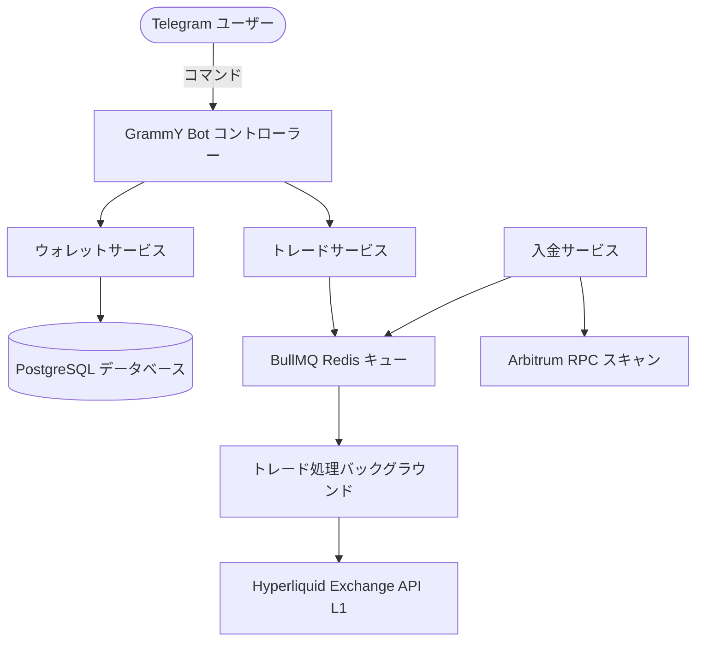

FoxBlaze は、低遅延の暗号資産取引のために設計された最新の高性能スタック上に構築されています。

## コアコンポーネント
- **TypeScript & NestJS**: モジュール式のバックエンド構造。
- **PostgreSQL & Prisma**: 状態を保持するリレーショナル DB。
- **BullMQ**: Redis ベースの信頼できる非同期キュー。
- **Hyperliquid SDK**: `@nktkas/hyperliquid` を用いたネイティブ統合。
