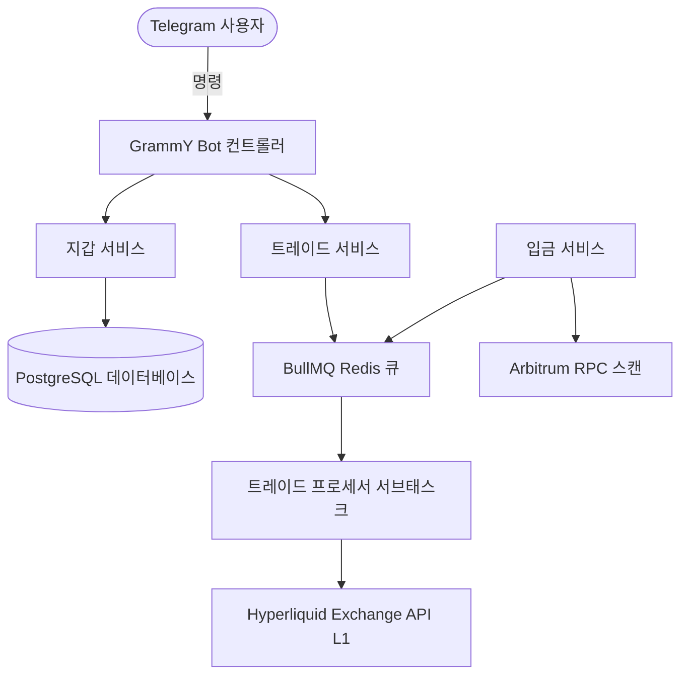

FoxBlaze는 짧은 대기 시간의 암호화폐 거래를 위해 설계된 최신 고성능 스택을 기반으로 구축되었습니다.

## 핵심 구성 요소
- **TypeScript 및 NestJS**: 모듈식 백엔드 구조.
- **PostgreSQL 및 Prisma**: 상태 유지를 위한 관계형 지속성 데이터베이스.
- **BullMQ**: Redis 기반의 안정적인 비동기 실행 대기열.
- **Hyperliquid SDK**: `@nktkas/hyperliquid`를 통한 Hyperliquid L1 기본 통합.
