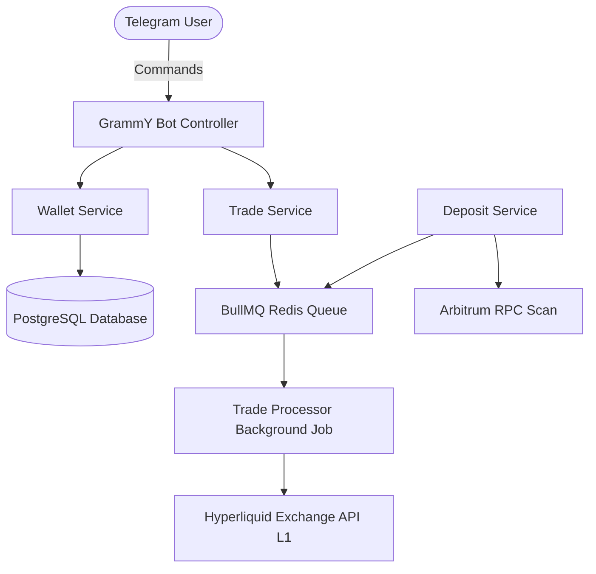

FoxBlaze is built on a modern, high-performance stack designed for low-latency crypto trading.

## Core Components
- **TypeScript & NestJS**: Modular backend structure.
- **PostgreSQL & Prisma**: Relational persistence for state.
- **BullMQ**: Reliable, Redis-backed asynchronous queue for execution.
- **Hyperliquid SDK**: Native integration via `@nktkas/hyperliquid` for the Hyperliquid L1 app-chain.
