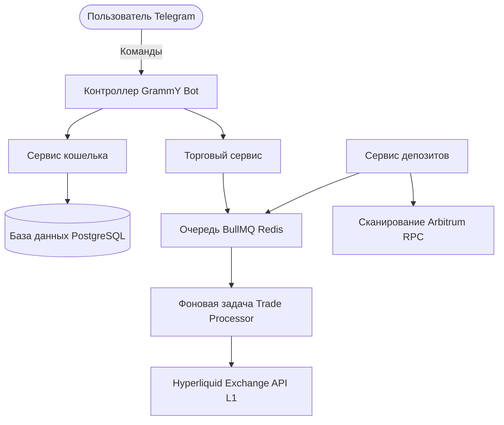

FoxBlaze построен на современном высокопроизводительном стеке, предназначенном для криптотрейдинга с низкой задержкой.

## Основные компоненты
- **TypeScript & NestJS**: Модульная серверная архитектура.
- **PostgreSQL & Prisma**: Реляционная база данных для сохранения состояния.
- **BullMQ**: Надежная асинхронная очередь на базе Redis.
- **Hyperliquid SDK**: Нативная интеграция через `@nktkas/hyperliquid` с L1-цепочкой Hyperliquid.
