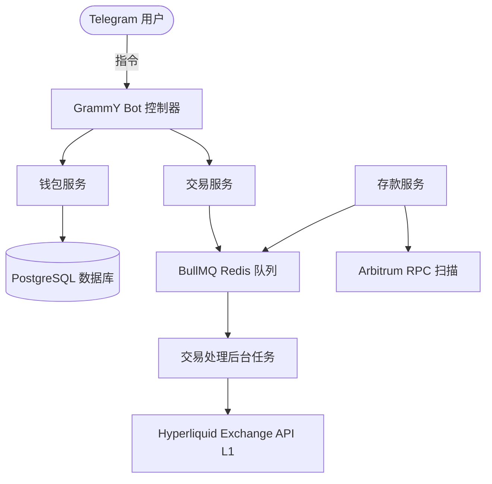

FoxBlaze 构建于现代、高性能的技术栈之上，专为低延迟加密货币交易而设计。

## 核心组件
- **TypeScript & NestJS**: 模块化的后端结构。
- **PostgreSQL & Prisma**: 用于状态持久化的关系型数据库。
- **BullMQ**: 基于 Redis 的可靠异步执行队列。
- **Hyperliquid SDK**: 通过 `@nktkas/hyperliquid` 与 Hyperliquid L1 应用链原生集成。
